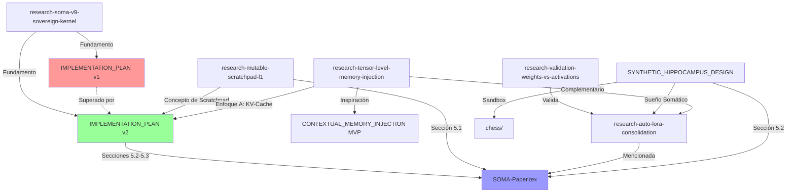

# 📚 SOMA Research Directory

Documentos de investigación, diseño y visión de frontera para la evolución de SOMA.

---

## 🗺️ Mapa de Documentos

### Publicación Académica
| Documento | Descripción | Estado |
|-----------|-------------|--------|
| [`SOMA-Paper.tex`](SOMA-Paper.tex) / [`.pdf`](SOMA-Paper.pdf) | Paper completo para arXiv: arquitectura de 4 capas, Somatic Pressure, benchmarks Leviathan | ✅ Listo para publicación |
| [`README-Compilation-paper-arXiv.md`](README-Compilation-paper-arXiv.md) | Instrucciones de compilación LaTeX con MiKTeX | Utilidad |

### Investigación de Frontera (Research Notes)
| Documento | Tema | Dependencias |
|-----------|------|-------------|
| [`research-mutable-scratchpad-l1.md`](research-mutable-scratchpad-l1.md) | L1 como memoria de trabajo editable durante inferencia | Standalone |
| [`research-tensor-level-memory-injection.md`](research-tensor-level-memory-injection.md) | Inyección directa de recuerdos en VRAM/KV-Cache | → [CONTEXTUAL_MEMORY_INJECTION](../proposals/CONTEXTUAL_MEMORY_INJECTION.md) |
| [`research-auto-lora-consolidation.md`](research-auto-lora-consolidation.md) | Consolidación nocturna de experiencia en pesos (Phase 9) | → Validation doc, Hippocampus |
| [`research-validation-weights-vs-activations.md`](research-validation-weights-vs-activations.md) | Validación externa (Jack Morris 2025) de decisiones SOMA | Standalone |

### Diseño Arquitectónico
| Documento | Tema | Estado |
|-----------|------|--------|
| [`SOMA_SYNTHETIC_HIPPOCAMPUS_DESIGN.md`](SOMA_SYNTHETIC_HIPPOCAMPUS_DESIGN.md) | Red neuronal "Sistema 1": encoding 400D, 3 cabezas de salida, Sueño Somático | Diseño |
| [`SOMA_V9_IMPLEMENTATION_PLAN-v2.md`](SOMA_V9_IMPLEMENTATION_PLAN-v2.md) | Plan activo: Sovereign Kernel con SGLang RadixAttention (Fork & Drop) | **Plan Activo** |
| [`SOMA_V9_IMPLEMENTATION_PLAN.md`](SOMA_V9_IMPLEMENTATION_PLAN.md) | Plan v1: Sovereign Kernel con KV-Cache Surgery directa | ⚠️ Superado por v2 |

### Documentos Visionarios
| Documento | Tema | Estado |
|-----------|------|--------|
| [`research-soma-v9-sovereign-kernel.md`](research-soma-v9-sovereign-kernel.md) | Visión original del Kernel Soberano: Hot Tools, Reloj Somático, L3 en VRAM | Fundacional → Desarrollado en planes v1/v2 |

### Chess Sandbox
| Documento | Tema |
|-----------|------|
| [`chess/CHESS_RESOLUTION_VISION.md`](chess/CHESS_RESOLUTION_VISION.md) | Visión de resolución de ajedrez |
| [`chess/NEURAL_TABLEBASE_DESIGN.md`](chess/NEURAL_TABLEBASE_DESIGN.md) | Diseño de tablebases neuronales |
| [`chess/NEURAL_TABLEBASE_IMPLEMENTATION_PLAN.md`](chess/NEURAL_TABLEBASE_IMPLEMENTATION_PLAN.md) | Plan de implementación |
| [`chess/NEURAL_TABLEBASE_SPEC_V2.md`](chess/NEURAL_TABLEBASE_SPEC_V2.md) | Especificación v2 |
| [`chess/SYNTHETIC_HIPPOCAMPUS_SOMA_TABLEBASES.md`](chess/SYNTHETIC_HIPPOCAMPUS_SOMA_TABLEBASES.md) | Puente entre Hipocampo Sintético y tablebases |
| [`chess/generate_krkp_dataset.py`](chess/generate_krkp_dataset.py) | Script de generación de datasets KRKvP |

---

## 🔗 Grafo de Dependencias

---

## 📖 Orden de Lectura Recomendado

1. **[`SOMA-Paper.tex`](SOMA-Paper.tex)** — El paper da la visión completa y sitúa todo lo demás
2. **[`research-mutable-scratchpad-l1.md`](research-mutable-scratchpad-l1.md)** — El doc de research mejor escrito; entiende limitaciones y posibilidades
3. **[`research-validation-weights-vs-activations.md`](research-validation-weights-vs-activations.md)** — Conecta la investigación externa con las decisiones de SOMA
4. **[`research-auto-lora-consolidation.md`](research-auto-lora-consolidation.md)** — La Fase 9: consolidación nocturna
5. **[`SOMA_SYNTHETIC_HIPPOCAMPUS_DESIGN.md`](SOMA_SYNTHETIC_HIPPOCAMPUS_DESIGN.md)** — El "Sistema 1" del agente
6. **[`SOMA_V9_IMPLEMENTATION_PLAN-v2.md`](SOMA_V9_IMPLEMENTATION_PLAN-v2.md)** — El plan técnico activo
7. **[`research-tensor-level-memory-injection.md`](research-tensor-level-memory-injection.md)** — La visión más radical
